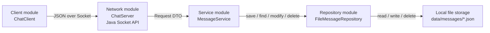
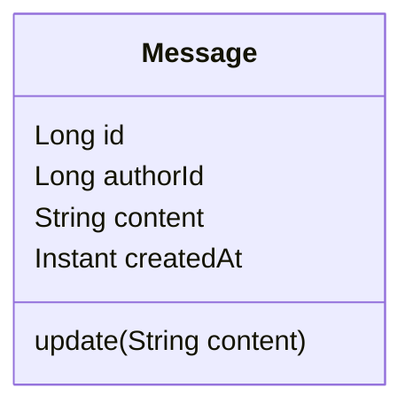
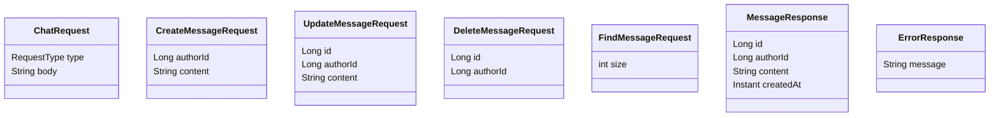
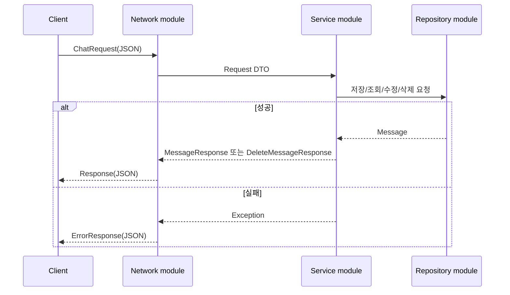

# Simple Chat

## 목표

- Java Socket API를 사용해 1:1 채팅 시스템을 구현한다.
- Spring Boot 등 네트워크 프레임워크를 사용하지 않고 raw level API로 통신한다.
- 메시지 발송, 수정, 삭제, 최근 메시지 조회 기능을 제공한다.

## 기능

### 메시지 발송

- 발송 성공 시 사용자가 입력한 메시지를 직렬화하여 로컬 파일에 저장한다.

### 메시지 삭제

- 주기적으로 데이터를 정리하는 시스템을 구현하지 않았기에 삭제 요청 시 데이터를 바로 삭제하는 hard delete 방식으로 처리한다.
- 요청자의 ID가 해당 메시지 작성자의 ID와 동일한 경우에만 삭제가 가능하다.

### 메시지 수정

- 요청자의 ID가 해당 메시지 작성자의 ID와 동일한 경우에만 수정이 가능하다.
- 메시지 수정은 서버의 단일 파일 저장소에 반영되며, 상대 클라이언트는 이후 LOAD 요청 시 수정된 메시지를 조회한다.
- 실시간 push 동기화는 구현 범위에서 제외한다.

### 최근 메시지 조회

- 작성일 기준 최근순으로 요청 DTO의 size 값만큼 메시지를 조회한다.

## 시스템 구조 설계

### Network module

- Java의 Socket을 사용해 메시지 송수신을 직접 구현한다.
- 객체를 JSON으로 직렬화/역직렬화하는 과정을 거쳐 통신한다.

### Service module

- 메시지 발송, 수정, 삭제, 조회에 대한 비즈니스 로직을 담당한다.
- Network module이 역직렬화한 요청 DTO를 받아 비즈니스 규칙을 검증한 뒤, Repository module에 저장/조회 작업을 위임한다.

### Repository module

- 메시지를 로컬 파일에 저장/삭제한다.
- 요청이 들어올 시 로컬 파일의 내용을 읽어서 반환한다.

### App module

- 서버 실행의 진입점이다.
- Repository, Service, Network module을 조립하고 지정 포트에서 서버를 시작한다.

### Client module

- 실제 서비스 용도가 아닌, localhost port로 통신해 API를 검증하는 클라이언트 코드이다.

## 객체 설계

### 대화방 가정

- 본 구현은 상대방 discovery가 제외된 과제 조건에 맞춰, 단일 고정 참여자 간 1:1 대화방 하나를 가정한다.
- 따라서 메시지는 별도의 roomId/receiverId 없이 하나의 대화 로그에 저장한다.

### Message

- `Long id`
  - UUID 대신 Long을 선택했다.
  - 로컬 DB에서 작동하는 소규모 시스템이기에 동시에 여러 서버에서 ID를 생성하는 경우를 배제한다.
  - 저장된 메시지 파일의 최대 ID 값을 기준으로 다음 ID를 생성하는 방식을 선택한다.
- `Long authorId`
- `String content`
- `Instant createdAt`

## DTO

- `ChatRequest`
  - `RequestType type`: SEND, MODIFY, DELETE, LOAD
  - `String body`
- `CreateMessageRequest`
  - `Long authorId`
  - `String content`
- `UpdateMessageRequest`
  - `Long id`
  - `Long authorId`
  - `String content`
- `DeleteMessageRequest`
  - `Long id`
  - `Long authorId`
- `FindMessageRequest`
  - `int size`
- `MessageResponse`
  - `Long id`
  - `Long authorId`
  - `String content`
  - `Instant createdAt`
- `ErrorResponse`
  - `String message`

## 실패 처리

- 잘못된 요청, 존재하지 않는 메시지, 작성자 불일치 등 요청 처리 실패 시 `ErrorResponse`를 반환한다.
- 실패한 요청은 파일 저장소에 반영하지 않는다.

## 주요 선택의 근거

- 네트워크 프레임워크 대신 `ServerSocket`, `Socket`을 사용해 raw level API 조건을 만족했다.
- Network module과 Message 관련 module을 Java package 기준으로 분리했다.
- memory DB를 사용하지 않고 메시지별 JSON 파일을 로컬 파일 시스템에 저장했다.
- 삭제는 별도 정리 작업이 없는 소규모 구현이라는 점을 고려해 hard delete로 처리했다.
- 수정 메시지의 상대방 반영은 실시간 push가 아닌 이후 LOAD 요청에서 반영되는 방식으로 제한했다.
- 상대방 discovery가 제외된 요구사항에 맞춰 단일 1:1 대화방을 가정했다.

## 개발 과정 중 주요 이슈와 해결 방식

- 1:1 채팅에서 상대방 discovery가 제외되어 있어 별도 사용자 검색이나 방 생성 흐름을 구현하지 않았다.
  - 단일 고정 참여자 간 대화방 하나를 가정하고, 메시지를 하나의 대화 로그에 저장하는 방식으로 범위를 제한했다.
- 메시지 수정 시 상대방 화면 반영을 실시간으로 처리할지 고민했다.
  - raw Socket 기반 구현 범위를 고려해 서버 저장소에 수정 내용을 반영하고, 상대 클라이언트가 이후 LOAD 요청 시 최신 상태를 조회하는 방식으로 결정했다.
- 실패 처리 책임이 Service/Repository와 Network module 사이에 섞일 수 있었다.
  - Service/Repository는 예외를 발생시키고, Network module이 이를 `ErrorResponse`로 변환해 응답하는 구조로 정리했다.

## AI 활용 범위

### 설계 문서

- 프롬프트 요지: Java Socket 기반 1:1 채팅 사전과제 요구사항을 만족하는 설계서 구조와 누락 항목 검토를 요청했다.
- 활용 결과: 모듈 분리 기준, 1:1 대화방 가정, 수정 메시지 반영 방식, hard delete 정책을 문서에 반영했다.
- 수정 방식: 실제 구현 코드와 맞지 않는 ErrorResponse, authorName 등은 제거하거나 authorId 기준으로 수정했다.

### 코드 검토

- 프롬프트 요지: 현재 코드가 과제 요구사항을 잘 반영하는지 검토를 요청했다.
- 활용 결과: Network/Service/Repository 분리, 파일 저장 방식, Socket API 사용 여부를 확인했다.
- 수정 방식: AI가 제안한 운영 서비스 수준의 확장 사항은 제외하고, 사전과제 범위에 필요한 가정과 한계를 문서화했다.
